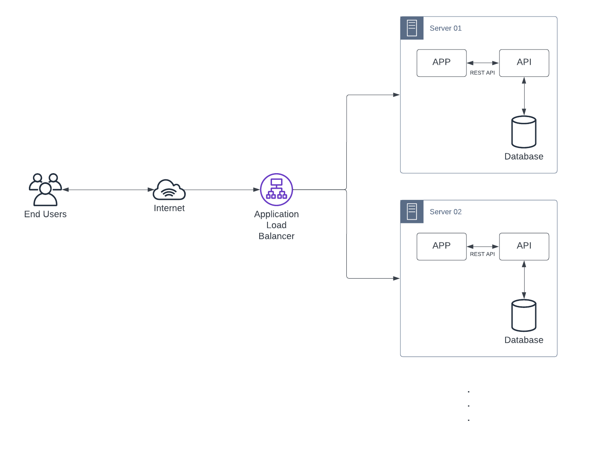
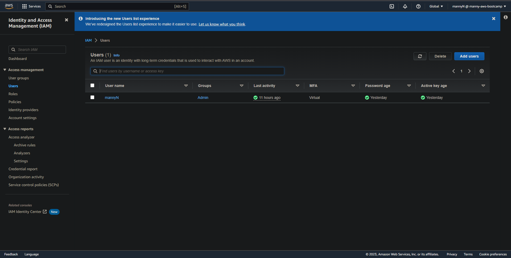
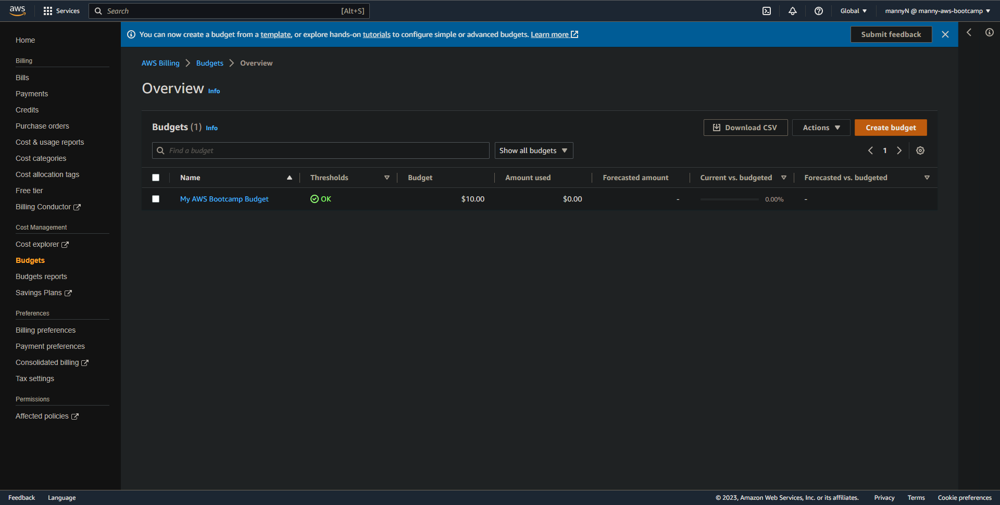
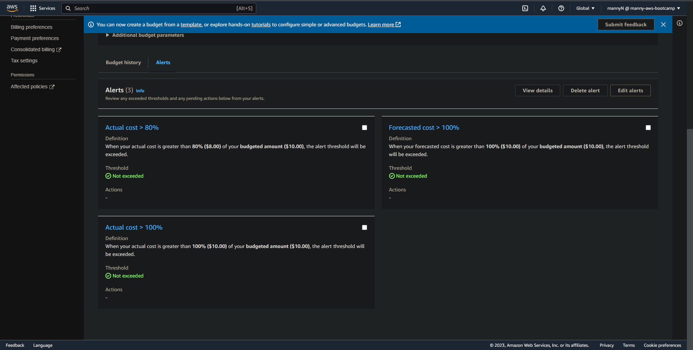
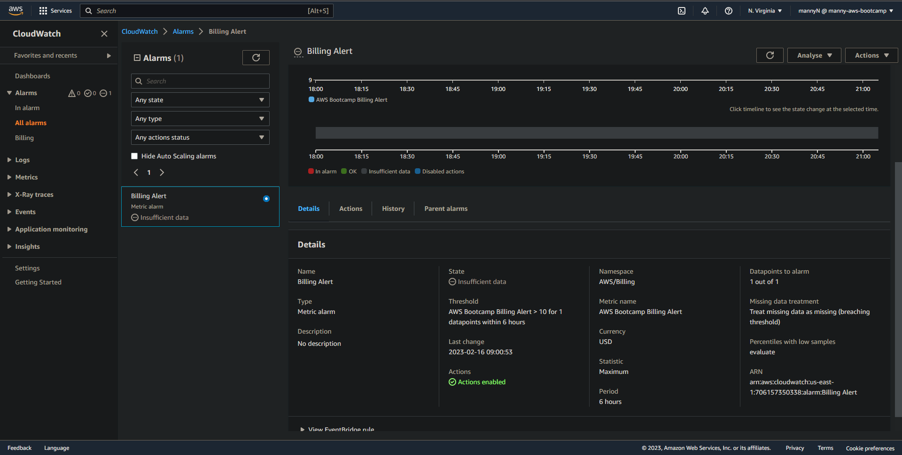

# Week 0 — Billing and Architecture

- In this week, we learnt about a variety of technologies to progress with our cloud knowledge. Some of the things we learnt includes: 
    * How to design diagrams using napkins as well as architectural diagrams of what we plan to build
    * How to use Lucid Charts to build architectural designs
    * About C4 Models
    * Look-through the cloud services we utilize
    * Setting up AWS free-tier and understand how to track spend in AWS (AWS Budgets, AWS Cost Explorer, Billing Alarms)
    * Understanding how to look at monthly billing reports
    * Launching AWS CloudShell and looking at AWS CLI
    * Generating AWS credentials

## Required Homework/Tasks
- To test if we grasped the concepts provided to us through the meeting as well as the provided videos to aid us, we were given homeworks. They are:
    - [X] Create an architectural diagram (to the best of your ability) the CI/CD logical pipeline in Lucid Charts.
    - [X] Setting an IAM role and securing it with MFA.
    - [X] Use EventBridge to hookup Health Dashboard to SNS and send notification when there is a service health issue.
    - [X] Review all the questions of each pillars in the Well Architected Tool (No specialized lens).
    - [X] Research the technical and service limits of specific services and how they could impact the technical path for technical flexibility. 
    - [X] Open a support ticket and request a service limit.

- I will describe my work and the process I overcame in the order provided above.

### Conceptual, Architectural(Logical) Diagrams

- The Conceptual (Napkin) Design I did looks like this. I know it isn't much, but hey, it's honest work :)


[Conceptual Diagram - Lucid Charts](https://lucid.app/lucidchart/ae2dab9c-3331-4b0a-b610-26a5be45672c/edit?viewport_loc=-216%2C-198%2C2720%2C1358%2CwcSxugjtXe~j&invitationId=inv_ce17d7f5-4aed-45ef-97a5-4e0fb7813844)

- The Logical Diagram for the application is shown below. I used the one given as an example and redesigned it a bit according to the [formatting powerpoint documentation by AWS.](https://media.amazonwebservices.com/architecturecenter/icons/AWS_Simple_Icons_ppt.pptx)

.png)
[Logical Diagram (Application) - Lucid Charts](https://lucid.app/lucidchart/ae2dab9c-3331-4b0a-b610-26a5be45672c/edit?viewport_loc=-5%2C-1039%2C1929%2C963%2C0_0&invitationId=inv_ce17d7f5-4aed-45ef-97a5-4e0fb7813844)

- The Logical Diagram I came up for the CI/CD pipeline is shown below. I'd like to improve this diagram when we further push into this course :)

.png)
[Logical Diagram (CI/CD) - Lucid Charts](https://lucid.app/lucidchart/ae2dab9c-3331-4b0a-b610-26a5be45672c/edit?viewport_loc=-191%2C153%2C2158%2C1077%2Cx_JxpN-KF3Eh&invitationId=inv_ce17d7f5-4aed-45ef-97a5-4e0fb7813844)

----------------------

### Setting an IAM role and securing it with MFA

- To set up the IAM role, I followed the steps provided in the video demonstrated by [Andrew Brown](https://www.youtube.com/watch?v=OdUnNuKylHg&list=PLBfufR7vyJJ7k25byhRXJldB5AiwgNnWv&index=14) on YouTube. The user I created is shown below.



- For both the IAM user and the root user, I set up MFA to strengthen the security of my AWS account. The proof is shown below.


-----------------------------------------

### Create a Cost and Usage budget

- I previously used the tutorial provided by [Chirag](https://youtu.be/OVw3RrlP-sI?list=PLBfufR7vyJJ7k25byhRXJldB5AiwgNnWv), But I had to remove that budget from my account because I was concerned of budget spending going over the free limit. The following command was used to create a Cost and Usage budget using the AWS CLI in my GitPod environment.
```
aws budgets create-budget \
    --account-id $AWS_ACCOUNT_ID \
    --budget file://aws/json/budget.json \
    --notifications-with-subscribers file://aws/json/budget-notifications-with-subscribers.json
```
The ```Budget.json``` file:
```
{
    "BudgetLimit": {
        "Amount": "10",
        "Unit": "USD"
    },
    "BudgetName": "My AWS Bootcamp Budget",
    "BudgetType": "COST",
    "CostFilters": {
        "TagKeyValue": [
            "user:Key$value1",
            "user:Key$value2"
        ]
    },
    "CostTypes": {
        "IncludeCredit": false,
        "IncludeDiscount": true,
        "IncludeOtherSubscription": true,
        "IncludeRecurring": true,
        "IncludeRefund": false,
        "IncludeSubscription": true,
        "IncludeSupport": true,
        "IncludeTax": true,
        "IncludeUpfront": true,
        "UseBlended": false
    },
    "TimePeriod": {
        "Start": 1477958399,
        "End": 3706473600
    },
    "TimeUnit": "MONTHLY"
}
```

```Budget.json``` file can be found [here](https://github.com/MannyNe/AWS-bootcamp/blob/week-0/aws/json/budget.json)

------------------------
The ```budget-notifications-with-subscribers.json``` file:
```
[
    {
        "Notification": {
            "ComparisonOperator": "GREATER_THAN",
            "NotificationType": "ACTUAL",
            "Threshold": 80,
            "ThresholdType": "PERCENTAGE"
        },
        "Subscribers": [
            {
                "Address": "amannnegussie2@outlook.com",
                "SubscriptionType": "EMAIL"
            }
        ]
    },
    {
        "Notification": {
            "ComparisonOperator": "GREATER_THAN",
            "NotificationType": "ACTUAL",
            "Threshold": 100,
            "ThresholdType": "PERCENTAGE"
        },
        "Subscribers": [
            {
                "Address": "amannnegussie2@outlook.com",
                "SubscriptionType": "EMAIL"
            }
        ]
    },
    {
        "Notification": {
            "ComparisonOperator": "GREATER_THAN",
            "NotificationType": "FORECASTED",
            "Threshold": 100,
            "ThresholdType": "PERCENTAGE"
        },
        "Subscribers": [
            {
                "Address": "amannnegussie2@outlook.com",
                "SubscriptionType": "EMAIL"
            }
        ]
    }
]
```
I added multiple notifications for my billing alarm to let me know if I passed the 80% and 100% threshold. I alse added a 100% forecast to the mix.



```budget-notifications-with-subscribers.json``` file can be found [here](https://github.com/MannyNe/AWS-bootcamp/blob/week-0/aws/json/budget-notifications-with-subscribers.json)

----------------------------

The CLI command I used for adding my email to my SNS topic is as follows. After that I confirmed the email I used to recieve notifications.
```
aws sns subscribe \
    --topic-arn arn:aws:sns:us-east-1:706157350338:Default_CloudWatch_Alarms_Topic \
    --protocol email \
    --notification-endpoint amannnegussie2@outlook.com
```


--------------------

### Creating a Cloudwatch Metric Alarm

- To add a metric alarm I run the statement below. I modified the time to notify me if the estimated charges for 6 hours exceeds 1$.
```
aws cloudwatch put-metric-alarm --cli-input-json file://aws/json/alarm_config.json
```

The ```alarm-config.json``` file:
```
{
    "AlarmName": "Billing Alert",
    "ActionsEnabled": true,
    "AlarmActions": [
        "arn:aws:cloudwatch:us-east-1:706157350338:alarm:Billing Alert"
    ],
    "EvaluationPeriods": 1,
    "DatapointsToAlarm": 1,
    "Threshold": 1,
    "ComparisonOperator": "GreaterThanThreshold",
    "TreatMissingData": "breaching",
    "Metrics": [{
        "Id": "m1",
        "MetricStat": {
            "Metric": {
                "Namespace": "AWS/Billing",
                "MetricName": "AWS Bootcamp Billing Alert",
                "Dimensions": [{
                    "Name": "Currency",
                    "Value": "USD"
                }]
            },
            "Period": 21600,
            "Stat": "Maximum"
        },
        "ReturnData": false
    }]
}
```


The ```alarm-config.json``` file can be found [here](https://github.com/MannyNe/AWS-bootcamp/blob/week-0/aws/json/alarm-config.json)

----------------------------------------------------------------

### Hooking up Health Dashboard to SNS using EventBridge
- I followed the documentation provided in [this link](https://docs.aws.amazon.com/health/latest/ug/cloudwatch-events-health.html#creating-event-bridge-events-rule-for-aws-health) to set the eventbridge with the health dashboard. In the [events console](https://console.aws.amazon.com/events/), we can navigate to the rules section to see newly added rules for events. My added rules is as follows:


-------------------

### Reviewing the questions of each pillars in the Well Architected Tool

The Well Architected Tool consists of the following six pillars:

- **Operational Excellence**, which asks how we utilize a fully automated operations pipeline for IT operations.

- **Security**, which asks how we ensure that our security accounts are always up to date.

- **Reliability**, which asks how we build highly reliable systems that self-heal and recover quickly when problems occur.

- **Performance Efficiency**, which asks how we ensure that our systems are running at peak performance efficiently.

- **Cost Optimization**, which asks how we reduce costs by utilizing cost optimization principles.

- **Business Agility**, which asks how we enable rapid responses to changing customer requirements and market trends.

----------------------

### Researching the technical and service limits of specific services and how they could impact the technical path for technical flexibility.


- I researched a bit about the AWS Free Tier and gathered some information. The Free Tier provides access to a range of services with no upfront costs or usage fees. The AWS Free Tier includes some usage limits that ensure that new customers have a positive customer experience when they start exploring AWS. These limits vary from service to service, and in some cases, may apply to certain resources or functions within a service. The free tier of Amazon EC2 provides access to 750/730 hours per month of t2.micro instance usage, or 30GB of total EBS storage per month.  If we exceed these limits, we would need to pay for additional services or delay certain tasks until monthly usage resets. Additionally, certain features may not be available in the free tier version of a service, such as Amazon S3 versioning or Amazon CloudFront caching. This may limit your technical flexibility in building an application.

-------------------------

### Open a support ticket and request a service limit

- I opened a support ticket by navigating to the [AWS Support Center](https://support.console.aws.amazon.com/support/home#/). On the left side menu, I selected “Create Case”, then selected “Looking for service limit increase?” from the link in the center right, then I specified what limit or feature I needed and clicked on “Create Case”. After that the ticket I opened looked like this: 

