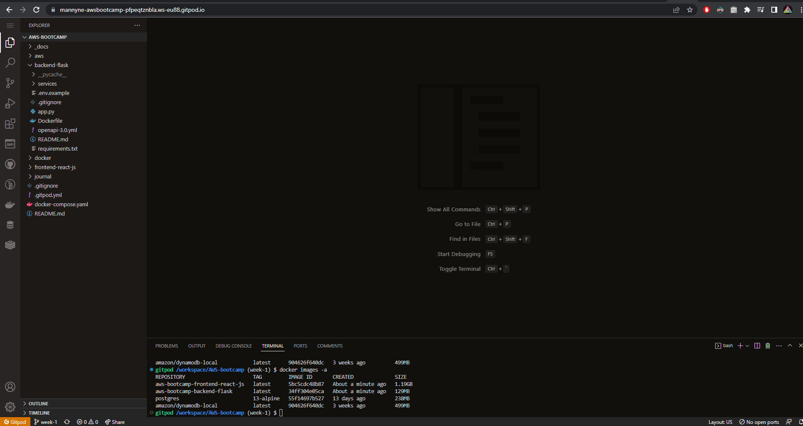
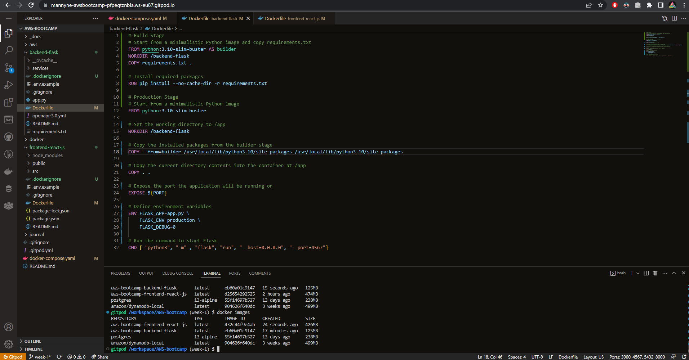
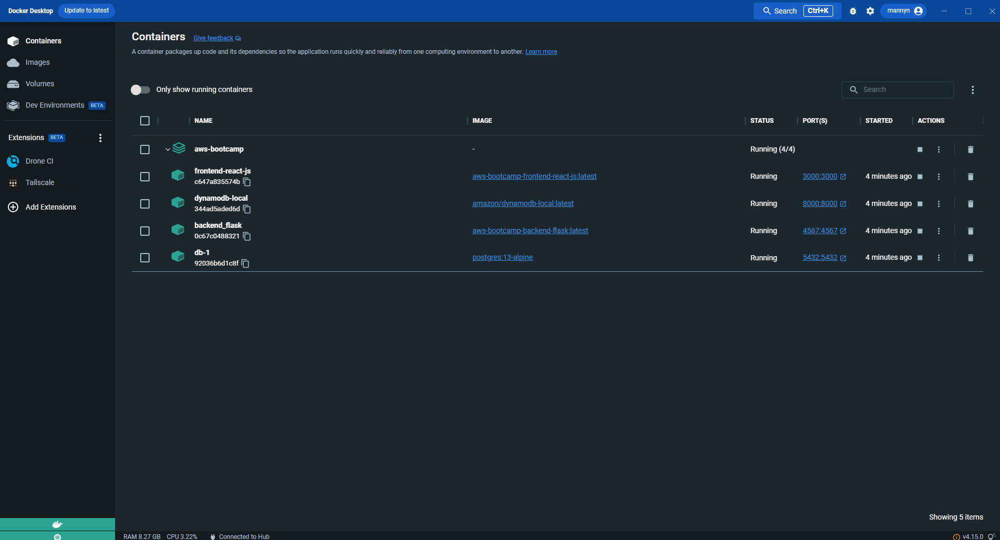
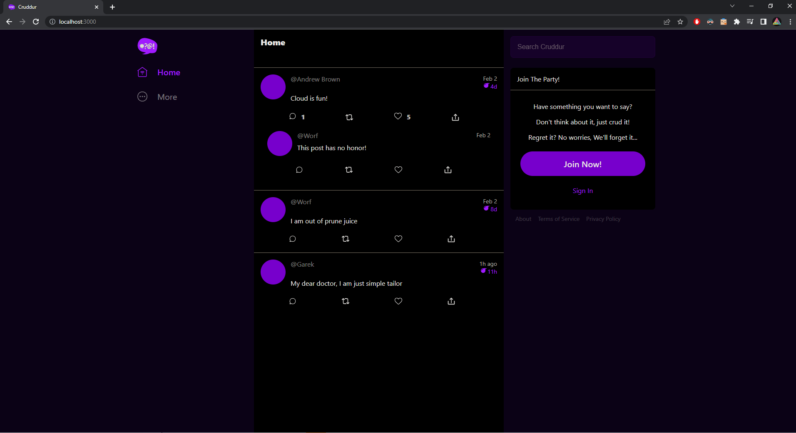
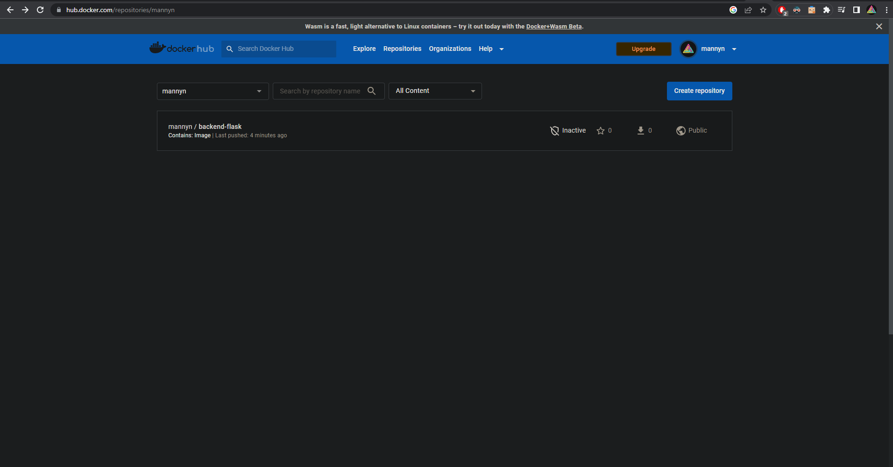

# Week 1 — App Containerization

- In this week, we learnt about a variety of technologies to progress with our containerization knowledge. Some of the things we learnt include: 
    * Exploring the codebases (Frontend and Backend)
    * How to run the frontend and backend locally without using docker
    * How to write a Dockerfile for each app
    * How to build and get the apps running via individual containers
    * how to create a docker-compose file
    * How we can orchestrate multiple containers to run side by side
    * How to mount directories so we can make changes while we code

## Required Homework/Tasks
- To test if we grasped the concepts provided to us through the meeting as well as the provided videos to aid us, we were given homeworks. They are:
    - [X] Research best practices of Dockerfiles and attempt to implement it in your Dockerfile.
    - [X] Use multi-stage building for a Dockerfile build.
    - [X] Running the dockerfile CMD as an external script.
    - [X] Implement a healthcheck in the V3 Docker compose file.
    - [X] Learn how to install Docker on your localmachine and get the same containers running outside of Gitpod / Codespaces.
    - [] Push and tag an image to DockerHub.
    - [] Launch an EC2 instance that has docker installed, and pull a container to demonstrate you can run your own docker processes. 

- I will describe my work and the process I overcame in the order provided above.

### Researching best practices for Dockerfiles
- I researched best practices for dockerfiles from different sites as well as from [Docker's documentation](https://docs.docker.com/develop/develop-images/dockerfile_best-practices/) for best practices. I learnt a lot about layering in docker, how caching works as well as how secrets and environment variables are handled. I'll dive deep about what I implemented with this new found knowledge especially in the coming homework sections. Some of the things I've learnt are provided below.
    - **Keeping the image size small** by using multi-stage builds and only including the necessary files and libraries to keep the image size small. This will help with faster deployment and reduce resource usage.
    - **Using official images** from the Docker Hub repository whenever possible, as they are maintained by the Docker community and are regularly updated with security patches.
    - **Creating a .dockerignore file** in the project directory to exclude unnecessary files and directories from the Docker build context. This significantly reduced the build time and image size for me personally.
    - **Using environment variables** instead of hardcoding values in the Dockerfile to make the image more configurable, easier to maintain and more secure.
    - **Using a specific tag for versioning**, such as a commit hash or a version number, to ensure that the same version of the image can be reproduced in the future.
    - **Limiting the number of layers in the Dockerfile**, as each layer adds overhead to the image size and can slow down the build process.
    - **Using a health check** in the Dockerfile to ensure that the container is running correctly and to detect any issues before they cause downtime.
    - **Removing any unnecessary files or dependencies** that were installed during the build process to keep the image size small and reduce potential security risks.
    - **Documenting the Dockerfile** by including clear and concise comments in the Dockerfile to document what the image does, how it should be used, and any configuration options.
    - **Testing the image thoroughly** to ensure that it works as expected and meets the requirements of the application or service it will be used for.

----------------------

### Using multi-stage building for a Dockerfile build
- I added a multi-stage build for both the frontend and the backend app. By adding this feature to my dockerfiles, I saw a great reduce in the size of my final images and improved build times.

    | Application 	| Old Size 	| New Size 	|
    |-------------	|----------	|----------	|
    | Frontend    	|  1.19 GB 	|  430 MB  	|
    | Backend     	|  129 MB  	|  125 MB  	|

- As we can see from the table, we can see that our frontend app image size decreased by approximately 63.87%, while the backend relatively stayed the same. I attached the proof down below (I would've attached the terminal only, but there would be no guarantee that I did it. Hence the URL :) ):


<div align="center" style="font-weight: bold; margin-bottom:12px; padding-top:0px">Fig 1.0: Initial Size</div>



<div align="center" style="font-weight: bold; margin-bottom:12px; padding-top:0px">Fig 1.1: Final Size</div>

----------------------

### Running the dockerfile CMD as an external script
- This was one of the challenging things to understand as a question. When I saw ``CMD as an external script``, I thought about a lot of things. But two stand out and I've implemented them both on my dockerfiles.

    1. Create a bash script that runs the command which was located within the CMD statement, then execute that shell script within CMD. I implemented this within my Backend App [Dockerfile](https://github.com/MannyNe/AWS-bootcamp/blob/week-1/backend-flask/Dockerfile) and created a script file called [init-backend.sh](https://github.com/MannyNe/AWS-bootcamp/blob/week-1/backend-flask/init-backend.sh). Take a peek below :)

    ```
    .
    .
    .
    # Run the command to start Flask
    CMD [ "bash", "./init-backend.sh" ]
    ```
    2. Create a bash script that runs the command which was located within the CMD statement, then execute it using an ENTRYPOINT command. I implemented this within my Frontend App [Dockerfile](https://github.com/MannyNe/AWS-bootcamp/blob/week-1/frontend-react-js/Dockerfile) and created a script file called [init-frontend.sh](https://github.com/MannyNe/AWS-bootcamp/blob/week-1/frontend-react-js/init-frontend.sh). Take a peek below :)

    ```
    .
    .
    .
    # Set the entrypoint command to run the script
    ENTRYPOINT ["bash", "./init-frontend.sh"]
    ```

----------------------
### Implement a healthcheck in the V3 Docker compose file
- When I first got introduced to docker and its containerization system, I wondered how it would insure its reliability and stability of the containers. There was this twitter post about it and how to integrate it. I wish I could find the tweet and credit him/her for this. I probably might edit this later if I do find that tweet. I modified the backend code to include a healthcheck route so that I could check if the API works fine instead of adding curl to the image which would increase the filesize of my image. The snippet below shows the new `docker-compose.yaml` file that has a healthcheck for all the services within it. 

```
version: "3.8"
services:
  backend-flask:
    container_name: "backend_flask"
    environment:
      FRONTEND_URL: "https://3000-${GITPOD_WORKSPACE_ID}.${GITPOD_WORKSPACE_CLUSTER_HOST}"
      BACKEND_URL: "https://4567-${GITPOD_WORKSPACE_ID}.${GITPOD_WORKSPACE_CLUSTER_HOST}"
    build: ./backend-flask
    ports:
      - "4567:4567"
    volumes:
      - ./backend-flask:/backend-flask
    healthcheck:
      test: ["CMD-SHELL", "./health-check.sh"]
      interval: 60s
      retries: 5
      start_period: 20s
      timeout: 5s
  frontend-react-js:
    container_name: "frontend-react-js"
    environment:
      REACT_APP_BACKEND_URL: "https://4567-${GITPOD_WORKSPACE_ID}.${GITPOD_WORKSPACE_CLUSTER_HOST}"
    build: ./frontend-react-js
    ports:
      - "3000:3000"
    volumes:
      - ./frontend-react-js:/frontend-react-js
      - /frontend-react-js/node_modules
    healthcheck:
      test: curl --fail http://localhost:3000 || exit 1
      interval: 60s
      retries: 5
      start_period: 20s
      timeout: 5s
      .
      .
      .
```
- [Here's](https://github.com/MannyNe/AWS-bootcamp/blob/week-1/docker-compose.yaml) the link for the file which contains healthchecks for each service except dynamodb which gave me some issues while implementing it.
----------------------
### Learn how to install Docker on your localmachine and get the same containers running outside of Gitpod / Codespaces
- I already had Docker Desktop installed before because I do some work with it. I followed [Docker's official documentation](https://docs.docker.com/desktop/install/windows-install/) on how to install the Windows edition. All I had to do next was run the command ``docker-compose up -d`` in my local copy of my repository. I attached the proof below.


<div align="center" style="font-weight: bold; margin-bottom:12px; padding-top:0px">Fig 1.0: Docker Desktop with containers running</div>


<div align="center" style="font-weight: bold; margin-bottom:12px; padding-top:0px">Fig 1.1: Locally running cruddr</div>

----------------------
### Push and tag an image to DockerHub
- I used a tutorial posted by [Bharathiraja](https://bharathirajatut.medium.com/about) in medium, whom is an AWS DevOps engineer. I pushed my backend-flask app by tagging and pushing it to my DockerHub repo. Here's the [link](https://medium.com/codex/dockerfile-explained-dockerize-nodejs-application-411dadbc3412) to Bharathiraja's tutorial. Here is the proof that I tagged and pushed my image to DockerHub:


<div align="center" style="font-weight: bold; margin-bottom:12px; padding-top:0px">Fig 1.0: Docker-CLI for pushing image</div>



<div align="center" style="font-weight: bold; margin-bottom:12px; padding-top:0px">Fig 1.1: DockerHub showing pushed image</div>

----------------------
### Launch an EC2 instance that has docker installed, and pull a container to demonstrate you can run your own docker processes

----------------------
